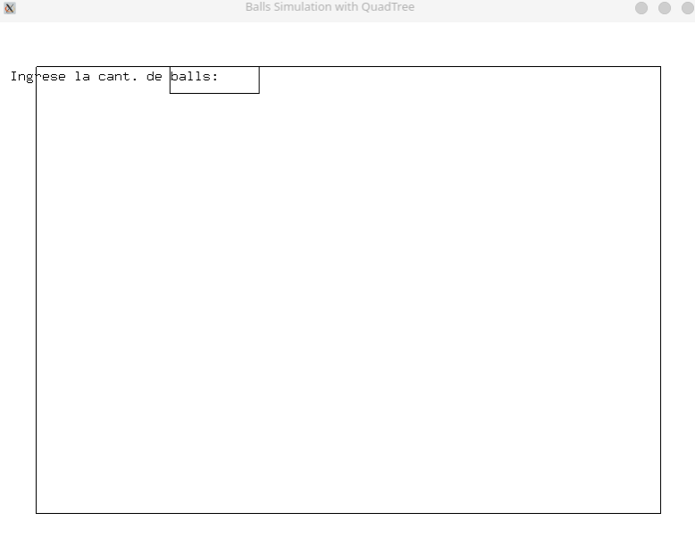

# Spatial Data Structures: KD-Tree & QuadTree

[](https://en.wikipedia.org/wiki/C%2B%2B17)
[](https://www.linux.org/)
[](https://www.opengl.org/)
[](https://opensource.org/licenses/MIT)

Implementación nativa y optimizada en C++ de estructuras de particionamiento espacial para renderizado 3D y detección de colisiones en 2D.

## Teoría y Arquitectura

### KD-Tree (G_P7.cpp)


El **KD-Tree** (k-dimensional tree) particiona el espacio 3D mediante planos perpendiculares a los ejes coordenados. Cada nivel del árbol alterna el eje de partición:

```
Nivel 0: Plano X = constante (divide YZ)
Nivel 1: Plano Y = constante (divide XZ)  
Nivel 2: Plano Z = constante (divide XY)
```

**Complejidad algorítmica:**

| Operación          | Promedio   | Peor caso |
|--------------------|------------|-----------|
| Inserción          | O(log n)   | O(n)      |
| Búsqueda           | O(log n)   | O(n)      |
| Nearest Neighbor   | O(log n)   | O(n)      |

### QuadTree (Q_P5.cpp)



El **QuadTree** particiona recursivamente el espacio 2D en cuatro cuadrantes (NW, NE, SW, SE). Cada nodo puede ser hoja (contiene datos) o rama (tiene 4 hijos).

**Complejidad algorítmica:**

| Operación   | Promedio   | Peor caso |
|-------------|------------|-----------|
| Inserción   | O(log n)   | O(n)      |
| Búsqueda    | O(log n)   | O(n)      |

### Optimización de Colisiones

En simulaciones con n entidades, la detección de colisiones naive es O(n²). Usando estructuras espaciales:

- **QuadTree**: O(n log n) — reduce drásticamente el espacio de búsqueda
- Solo se verifican entidades en cuadrantes adyacentes

---

## Estructura del Repositorio

```
.
├── G_P7.cpp          # Simulador KD-Tree 3D con visualización OpenGL
│                     # Inserta puntos via UI, visualiza particiones
├── Q_P5.cpp          # Simulador de bolas con colisiones 2D
│                     # Usa QuadTree para detección de colisiones
├── QUAD.h            # Header: implementación del QuadTree
├── KD.h              # Header: implementación del KD-Tree
└── README.md         # Este archivo
```

---

## Compilación y Ejecución

### Linux (GCC/G++)

```bash
# Dependencias
sudo apt-get install libglu1-mesa-dev freeglut3-dev

# Compilar KD-Tree
g++ -o kd_tree G_P7.cpp -lGL -lGLU -lglut

# Compilar QuadTree  
g++ -o quadtree Q_P5.cpp -lGL -lglut

# Ejecutar
./kd_tree
./quadtree
```

### Windows (MinGW)

```bash
# Instalar freeglut para MinGW
# Compilar
g++ -o kd_tree.exe G_P7.cpp -lOpenGL32 -lglu32 -lfreeglut
g++ -o quadtree.exe Q_P5.cpp -lOpenGL32 -lfreeglut

# Ejecutar
kd_tree.exe
quadtree.exe
```

### macOS (Clang)

```bash
# Instalar freeglut
brew install freeglut

# Compilar
clang++ -o kd_tree G_P7.cpp -framework OpenGL -framework GLUT -lstdc++
clang++ -o quadtree Q_P5.cpp -framework OpenGL -framework GLUT -lstdc++

# Ejecutar
./kd_tree
./quadtree
```

---

## Controles

### KD-Tree (G_P7.cpp)
- **Mouse drag (vista 3D)**: Rotar cubo
- **+ / -**: Escalar eje
- **Campos X/Y/Z**: Ingresar coordenadas
- **Botón "Agregar"**: Insertar punto en el árbol

### QuadTree (Q_P5.cpp)
- **Input numérico**: Cantidad de bolas a generar
- **Enter**: Confirmar generación
- Las bolas colisionan automáticamente usando el QuadTree

---

## Referencias Teóricas

- Bentley, J. L. (1975). "Multidimensional Binary Search Trees Used for Associative Searching"
- Samet, H. (2006). "Foundations of Multidimensional and Metric Data Structures"

---

## Licencia

MIT License - Ver archivo LICENSE para detalles.
